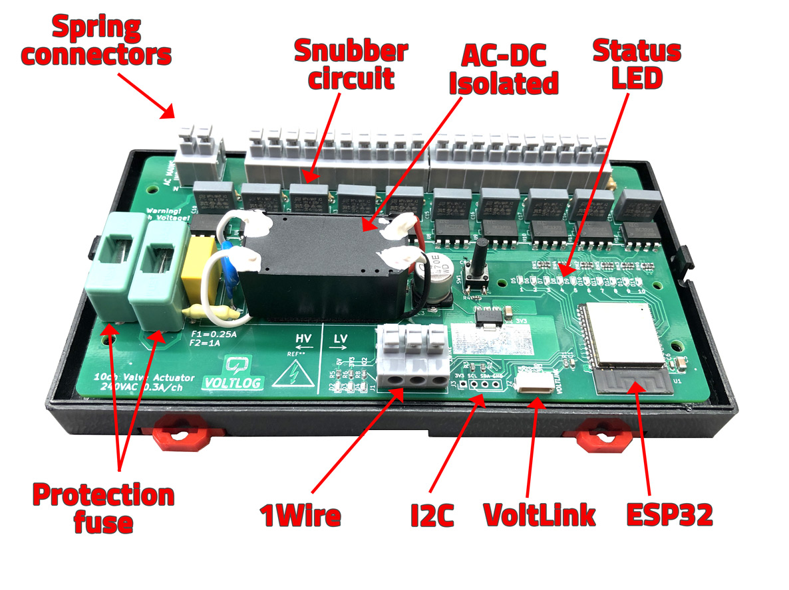

# 10ch Valve Actuator (Tasmota compatible)
I designed this 10 channel valve actuator board to be able to control up to 10 electrical valve actuators for my floor heating system. It is based on an ESP32 which makes it Tasmota/MQTT compatible and this allows me to easily integrate it into my HomeaAssistant server. For more information check out [Voltlog #383](https://youtu.be/kZS3ggG0QJI).

If you are looking for sources of previous revisions (revA, revB, revC) checkout the different branches of this repo.

To flash the ESP32 you can use a VoltLink usb/serial converter or you can use your own usb-serial converter module through the on-board JST-SH 1.0mm pitch 6 pin connector. After loading the initial firmware, you can update the firmware via OTA. By default board will ship loaded with Tasmota. 

If you would like to order one of these boards ready assembled, check out my [Tindie store](https://www.tindie.com/products/voltlog/tasmota-esp32-floor-heating-valve-controller/).

## Tasmota template revD (do not use this for previous revisions)
{"NAME":"Voltlog Valve Actuator revD","GPIO":[0,3200,288,3232,0,0,0,0,0,228,229,227,234,0,226,225,0,640,608,224,0,232,231,230,0,0,0,0,233,0,32,0,0,0,0,0],"FLAG":0,"BASE":1}

## WARNING
This board has high-voltage AC present which may cause severe personal injury or death if not handled with care. If you are in doubt, please ask for a profesional to install the system for you.

## Changelog revD
- Added support for powering valves with separate voltage input.
- Switched multiple components to SMD variant for DFM purposes.
- Switched to using JST SH connector for expansion GPIO.

For more defails on revD changes checkout this video [Voltlog #467](https://youtu.be/UIELTaJPIKA).

